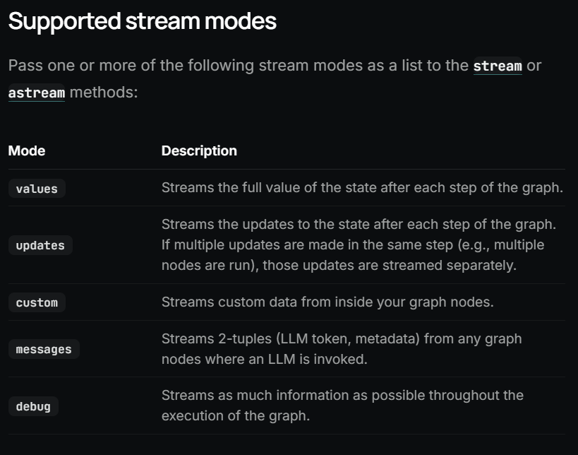

## Checkpointing : 

1. LangGraph has a built-in persistence layer, implemented through checkpointers. When you compile a graph with a 
checkpointer, the checkpointer saves a checkpoint of the graph state at every super-step. Those checkpoints are 
saved to a thread, which can be accessed after graph execution. Because threads allow access to graph’s state 
after execution, several powerful capabilities including human-in-the-loop, memory, time travel, and 
fault-tolerance are all possible.

2. A thread is a unique ID or thread identifier assigned to each checkpoint saved by a checkpointer. It contains 
the accumulated state of a sequence of runs. When a run is executed, the state of the underlying graph of the 
assistant will be persisted to the thread.

3. When invoking a graph with a checkpointer, you must specify a thread_id as part of the configurable portion of 
the config.
{"configurable": {"thread_id": "1"}}

4. The state of a thread at a particular point in time is called a checkpoint. Checkpoint is a snapshot of the 
graph state saved at each super-step and is represented by StateSnapshot object .


## Streaming : 

1. LangGraph implements a streaming system to surface real-time updates. Streaming is crucial for enhancing the 
responsiveness of applications built on LLMs. By displaying output progressively, even before a complete response 
is ready, streaming significantly improves user experience (UX), particularly when dealing with the latency of 
LLMs.

2. What’s possible with LangGraph streaming:
 Stream graph state — get state updates / values with updates and values modes.
 Stream subgraph outputs — include outputs from both the parent graph and any nested subgraphs.
 Stream LLM tokens — capture token streams from anywhere: inside nodes, subgraphs, or tools.
 Stream custom data — send custom updates or progress signals directly from tool functions.
 Use multiple streaming modes — choose from values (full state), updates (state deltas), messages (LLM tokens + metadata), custom (arbitrary user data), or debug (detailed traces).
​



Ex : 
instead of graph.invoke , need to do  graph.stream
single mode  :
```python
for mode, chunk in graph.stream(inputs, stream_mode=["updates", "custom"]):
    print(chunk)
```

multi mode : 
```python
for mode, chunk in graph.stream(inputs, stream_mode=["updates", "custom"]):
    print(chunk)
```


## Monitoring: 
LangSmith Observability gives you complete visibility into agent behavior with tracing, real-time monitoring, 
alerting, and high-level insights into usage.