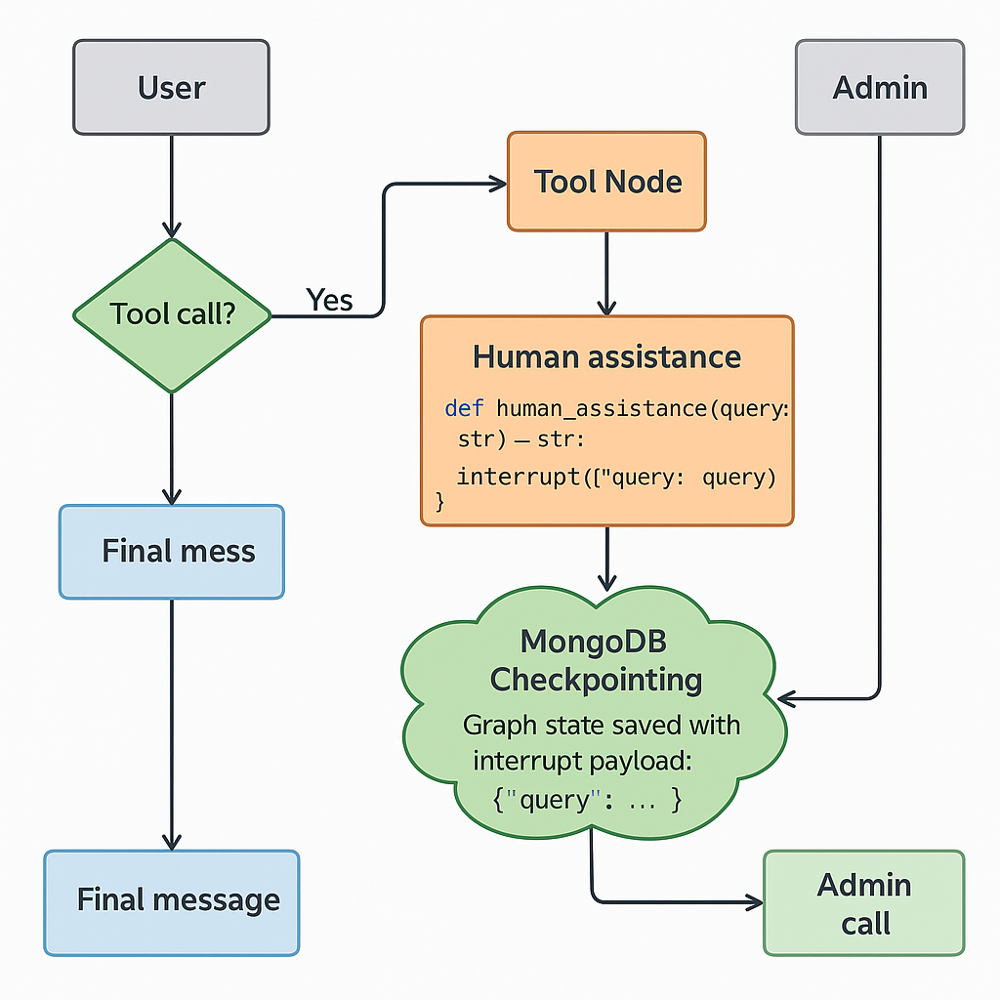

## TOOL CALLS : 
1. tool_Call.py is an example of hybrid workflow.

## HUMAN IN THE LOOP: 

#### Human Assistance Tool: 
What it does

1. Declares a tool called human_assitance (typo in name is okay, just consistent).

2. It takes a query: str — this will usually be a “please ask human X” type content.

3. When called, it:

  Calls interrupt({"query": query}).

This triggers LangGraph to stop execution.

It also stores the graph state (including this {"query": ...} payload) in MongoDB via the checkpointer.

The tool never immediately returns a real value at this point — we “pause”.

When the graph is later resumed with Command(resume={"data": solution}),
human_response will receive the solution data.

So this tool is a bridge between the LLM and a human:

LLM calls tool → tool raises interrupt → human sees query → human answers → flow resumes.

#### Admin / Human Flow (admin_call):

What this does


Same MongoDB + graph setup with the same thread_id "13":


This ensures you are looking at the same conversation that got interrupted.

state = graph_with_cp.get_state(config=config)


Fetches the latest checkpointed state from Mongo for this thread.


This includes:


values (e.g. messages),


interrupts,


metadata, etc.

Check for interrupts:
```python
if not state.interrupts:
    print("No pending human assistance interrupt.")
    return
```


If there is no interrupt recorded, there’s nothing waiting for a human.


Get last interrupt:
```python
last_interrupt = state.interrupts[-1]
interrupt_payload = last_interrupt.value  # {'query': '...'}
user_query = interrupt_payload.get("query")
```

From your human_assitance tool, you did:
interrupt({"query": query})


So here you recover that {"query": ...}.


user_query is what the LLM asked the human to help with.


Show it to the admin / human:
print("User has a query:", user_query)
solution = input("-> ")


Human types an answer.


Resume the graph with human’s answer:
```python
resume_command = Command(resume={"data": solution})

for event in graph_with_cp.stream(resume_command, config, stream_mode="values"):
    if "messages" in event:
        event["messages"][-1].pretty_print()

```

Command(resume={"data": solution}) tells LangGraph:


“Continue from the last interrupt, and treat solution as the return value of human_assitance.”


Internally, this means:


human_response = interrupt({"query": query})
now gets assigned solution as its value.


The tool returns solution to the LLM.


The LLM sees the tool result and continues generating the next response, which gets printed.


So admin_call is the “human backend” handling pending interrupts and pushing answers back into the graph.


#### High-Level Summary:
1. User talks to bot → user_call() runs graph.
2. LLM decides it needs a human → calls human_assitance.
3. human_assitance calls interrupt → graph pauses, state saved to Mongo.
4. Admin tool (admin_call()) reads last interrupt from Mongo:
5. Extracts the query, Shows it to human, Human types the solution.
6. Admin resumes the graph with Command(resume={"data": solution}):
7. The tool returns this solution back to the LLM,
8. LLM continues and produces a final message for the user.


Flow diag :
